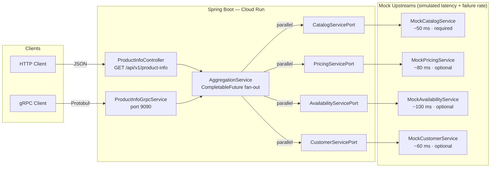

# Product Information Aggregator

> **A production-grade Spring Boot microservice that fans out to four upstream services in parallel over REST and gRPC, assembles a unified product-information response in under 200 ms, and degrades gracefully when optional services fail — deployed to GCP Cloud Run via Terraform and GitHub Actions.**

---

## Architecture



All four upstream calls are fired simultaneously from a dedicated thread pool. The slowest optional call is the bottleneck; catalog failure immediately returns HTTP 503 / gRPC UNAVAILABLE.

---

## Tech Stack

| Layer | Technology |
|---|---|
| Language | Java 17 |
| Framework | Spring Boot 3.2.3 |
| API | REST (Spring MVC) + gRPC (`grpc-server-spring-boot-starter`) |
| Schema | Protocol Buffers 3 |
| Build | Maven (`protobuf-maven-plugin` for code generation) |
| Infrastructure | Terraform (Artifact Registry + Cloud Run) |
| Cloud | GCP Cloud Run (europe-west1) |
| CI/CD | GitHub Actions (build → Docker push → Cloud Run deploy) |
| Auth | GCP Workload Identity Federation (keyless) |
| Runtime | Eclipse Temurin 17 JRE Alpine (multi-stage Docker) |
| Testing | JUnit 5, Mockito, Spring MockMvc |

---

## Local Setup

### Prerequisites

- Java 17+
- Maven 3.8+ (or use the included `./mvnw` wrapper)
- Docker (optional, for container testing)
- `grpcurl` (optional, for gRPC testing)

### Run

```bash
./mvnw spring-boot:run
```

The service starts on:
- **REST**: `http://localhost:8080`
- **gRPC**: `localhost:9090`
- **Health**: `http://localhost:8080/actuator/health`

### REST Examples

**Full request (authenticated customer):**
```bash
curl "http://localhost:8080/api/v1/product-info?productId=KR-12345&market=nl-NL&customerId=C-98765"
```

**Anonymous request:**
```bash
curl "http://localhost:8080/api/v1/product-info?productId=KR-12345&market=de-DE"
```

**Degraded pricing (pricing service failure simulated):**
```bash
# Send many requests — ~0.5% trigger a pricing failure, returning pricing.status=UNAVAILABLE
for i in $(seq 1 200); do
  curl -s "http://localhost:8080/api/v1/product-info?productId=KR-$i&market=pl-PL" | jq .pricing.status
done
```

**Validation error:**
```bash
curl "http://localhost:8080/api/v1/product-info?market=nl-NL"
# → 400 {"code":"MISSING_PARAMETER","message":"Required parameter 'productId' is missing"}
```

### gRPC Example

```bash
grpcurl -plaintext \
  -d '{"product_id":"KR-12345","market":"nl-NL","customer_id":"C-99"}' \
  localhost:9090 \
  kramp.aggregator.ProductInfoService/GetProductInfo
```

### Docker

```bash
./mvnw package -DskipTests
docker build -t product-info-aggregator .
docker run -p 8080:8080 -p 9090:9090 product-info-aggregator
```

---

## Running Tests

```bash
./mvnw test
```

The test suite contains **21 tests** across three classes:

| Class | Tests | What it covers |
|---|---|---|
| `AggregationServiceTest` | 10 | Happy path, catalog failure → 503, each optional service degraded, all optionals fail simultaneously, market-currency mapping, anonymous vs personalised |
| `ProductInfoControllerTest` | 6 | HTTP 200/400/503, missing params, degraded pricing still 200, MockMvc layer |
| `MockCatalogServiceTest` | 5 | Deterministic hash-based data generation, spec keys, image URL format |

Tests use `@ExtendWith(MockitoExtension.class)` with `@Mock` ports and a synchronous `Executor` (`Runnable::run`) so `CompletableFuture` behaviour is deterministic in unit tests.

---

## Design Decisions

### Why `CompletableFuture` over WebFlux / Project Reactor

The upstream services are synchronous blocking stubs (and will be real HTTP/gRPC clients in production). WebFlux shines when the entire I/O chain is reactive; introducing it here would require wrapping every blocking call in `Mono.fromCallable(...).subscribeOn(Schedulers.boundedElastic())` — the same thread-pool isolation `CompletableFuture` gives with far less ceremony. The dedicated `aggregatorExecutor` pool keeps upstream I/O off HTTP handler threads without adding a reactive dependency.

### Why Port/Adapter (Hexagonal) Pattern

`AggregationService` depends on four interfaces (`CatalogServicePort`, `PricingServicePort`, etc.) rather than concrete classes. This means:
- The service is testable with plain Mockito mocks — no Spring context required.
- Swapping mock implementations for real HTTP/gRPC clients requires zero changes to business logic.
- Each adapter can be versioned, replaced, or circuit-broken independently.

### Why Workload Identity Federation over JSON Service-Account Keys

JSON keys are long-lived credentials that must be rotated, stored as secrets, and can leak. Workload Identity Federation issues short-lived OIDC tokens tied to the GitHub Actions run identity. There are no secrets to rotate, no keys to leak, and the permission boundary is narrowed to the exact repository and branch that triggers the deployment.

### How Partial Failure Is Handled

| Service | Classification | On failure |
|---|---|---|
| Catalog | **Required** | Throws `CatalogUnavailableException` → HTTP 503 / gRPC UNAVAILABLE |
| Pricing | Optional | Returns `PricingInfo` with `status=UNAVAILABLE`, null price fields, currency preserved |
| Availability | Optional | Returns `AvailabilityInfo` with `status=UNKNOWN`, null warehouse/stock fields |
| Customer | Optional | Returns `CustomerInfo` with `status=DEFAULT`, null segment/preferences |

Each optional future uses `.handle((data, ex) -> ...)` so a timeout or exception never propagates — the caller always gets a structurally valid response. Failures are logged as WARN; only catalog failures are logged as ERROR.

---

## What I Would Add with More Time

- **Circuit breakers** — Resilience4j `@CircuitBreaker` per upstream port, with half-open probing. Prevents a flapping Pricing service from exhausting the thread pool.
- **Redis caching** — Cache catalog data (low churn) for 5 minutes by `productId`. Pricing gets a shorter TTL and must be customer-scoped to avoid leaking personalised prices.
- **Structured logging with correlation IDs** — Propagate an `X-Request-ID` header through MDC so every log line for a single request shares the same trace ID. Essential for Cloud Logging queries in production.
- **gRPC server-side streaming** — For batch product lookups (e.g. a cart with 50 items), stream responses as they complete rather than blocking until all are done.
- **OpenTelemetry tracing** — Instrument each `CompletableFuture` span so Cloud Trace shows the wall-clock breakdown of catalog vs pricing vs availability per request.
- **Contract tests** — Pact consumer-driven contracts for each port so breaking changes in upstream schemas fail in CI before they reach production.
- **Helm / Kustomize overlays** — Right now environment differences (staging vs prod failure rates, timeouts) live in `application.yml`. Parameterising them via Helm values makes multi-environment promotion safe.

---

## Design Question Answer — Option A: Related Products Service

> *How would you extend this aggregator to also return a list of related products for each product lookup?*

### Approach

**Add a `RelatedProductsServicePort` interface** following the same Port/Adapter pattern:

```java
public interface RelatedProductsServicePort {
    List<String> fetchRelatedProductIds(String productId, String market, int limit);
}
```

**Fire it in parallel with the existing four calls** inside `AggregationService.aggregate()`:

```java
CompletableFuture<List<String>> relatedFuture =
    supplyWithTimeout(
        () -> relatedProductsService.fetchRelatedProductIds(productId, market, 5),
        properties.getTimeouts().getRelatedProducts()   // e.g. 300 ms
    );
```

**Treat it as optional** (same `.handle()` degradation as Pricing/Availability). A missing related-products list degrades gracefully to an empty list rather than failing the whole response.

**Extend the response model:**

```java
@Value @Builder
public class ProductInfoResponse {
    // ... existing fields ...
    List<RelatedProductInfo> relatedProducts;  // empty list on degradation
}
```

**Proto extension** — add a repeated field to `ProductInfoResponse`:

```protobuf
message ProductInfoResponse {
    // ... existing fields ...
    repeated RelatedProductInfo related_products = 7;
}
message RelatedProductInfo {
    string product_id = 1;
    string name       = 2;
    string status     = 3;
}
```

### Key trade-offs

| Concern | Decision |
|---|---|
| Latency | Related products call runs in parallel — no added latency vs current wall-clock if it returns within the timeout |
| Depth | Return product IDs only in the first call; a client that needs full product info for a related item makes a second call. Avoids N+1 recursive aggregation on the hot path. |
| Caching | Related product graphs are stable (hourly churn); this is the highest-value cache candidate — a 60-second Redis TTL eliminates most upstream calls |
| Failure | Empty list on timeout/error — the parent product response is never sacrificed for related products |
| Testing | New `MockRelatedProductsService` follows the same `AbstractMockService` pattern; `AggregationServiceTest` gets two new cases: success with related products, and degraded (empty list) on failure |

---

## Live Endpoint

The service is deployed on GCP Cloud Run in `europe-west1`. The URL is printed as a Terraform output after `terraform apply`:

```bash
cd terraform
terraform output service_url
```

The REST health check is publicly accessible:
```bash
curl "$(terraform output -raw service_url)/actuator/health"
```

> **Note:** The Cloud Run instance scales to zero when idle. The first request after a cold start may take 2–4 seconds while the JVM initialises.

---

## Project Structure

```
src/main/java/com/kramp/aggregator/
├── AggregatorApplication.java
├── config/
│   ├── AppProperties.java        # Per-service timeouts and failure rates
│   └── AsyncConfig.java          # Dedicated thread pool for upstream I/O
├── controller/
│   └── ProductInfoController.java # REST entry point
├── grpc/
│   └── ProductInfoGrpcService.java # gRPC entry point
├── exception/
│   ├── CatalogUnavailableException.java
│   ├── UpstreamServiceException.java
│   └── GlobalExceptionHandler.java
├── model/
│   ├── response/                 # API-facing models (CatalogInfo, PricingInfo, …)
│   └── upstream/                 # Internal data records from upstream ports
├── service/
│   ├── AggregationService.java   # Core fan-out and assembly logic
│   ├── port/                     # Interfaces (hexagonal adapters)
│   └── upstream/                 # Mock implementations
└── util/
    └── MarketUtils.java          # BCP 47 market → ISO 4217 currency
src/main/proto/
└── product_info.proto
terraform/
├── main.tf                       # Artifact Registry + Cloud Run
├── variables.tf
└── outputs.tf
.github/workflows/
└── ci-cd.yml                     # build → docker → deploy
```
